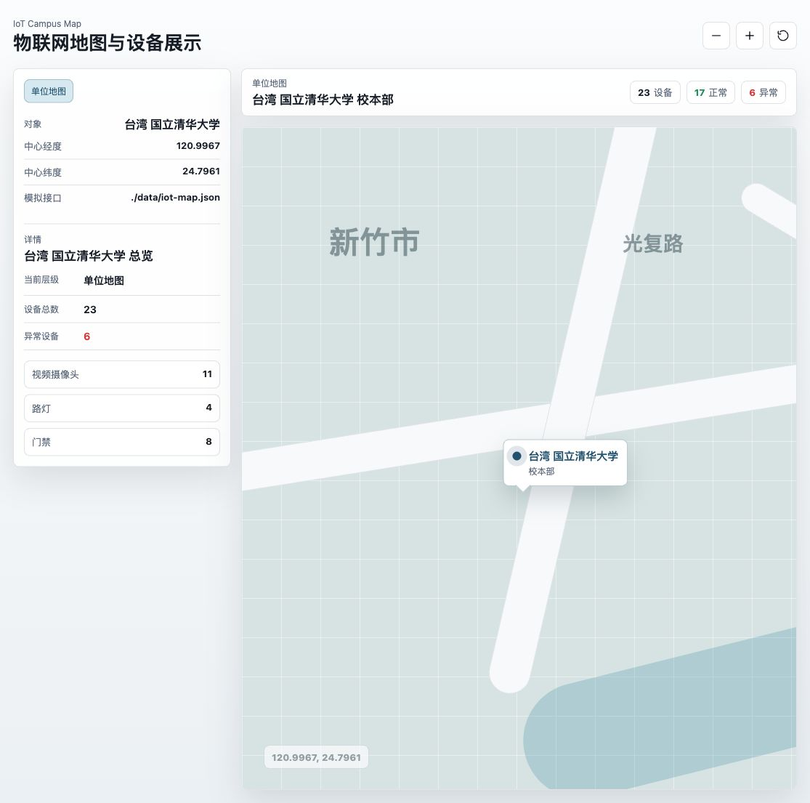
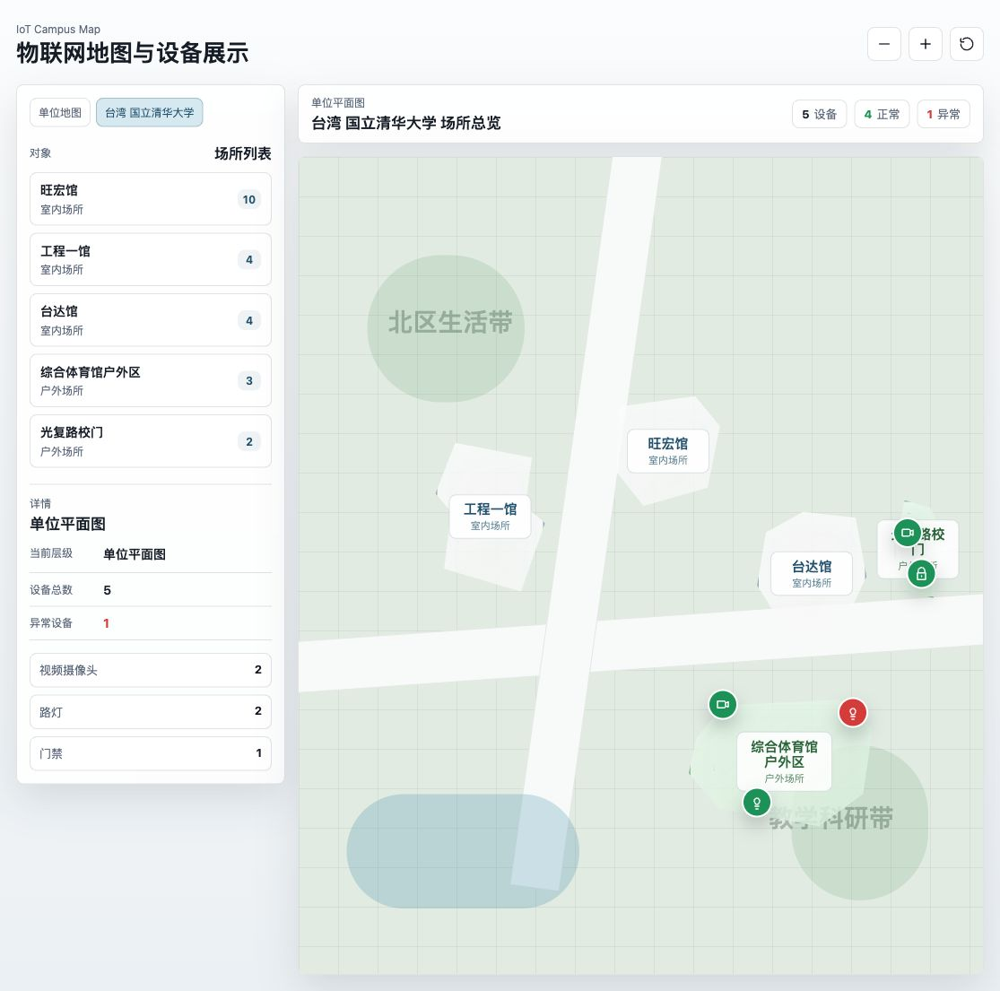
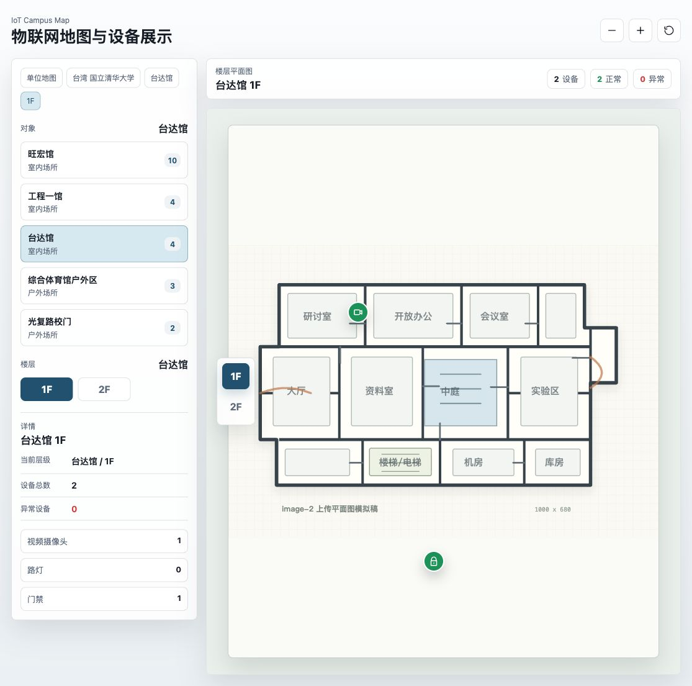

# IoT Campus Map Demo

一个面向智慧校园、园区运维和物联网设备监控场景的前端 demo。项目用静态 JSON 模拟接口数据，展示从单位地图、场所平面图、楼层平面图到设备点位状态的逐级交互。



## Project Status

This repository is maintained as an early-stage open-source reference implementation. The current focus is to make the demo easy to inspect, reuse, and extend before adding heavier framework or backend dependencies.

Maintainer: [foumu](https://github.com/foumu)

## Online Demo

GitHub Pages 发布后可访问：

[https://foumu.github.io/iot-map/](https://foumu.github.io/iot-map/)

如果 Pages 还未启用，可在仓库 `Settings -> Pages` 中选择 `Deploy from a branch`，然后选择 `main` 分支和 `/root` 目录。

## Features

- Unit-level map centered on a simulated campus: `台湾 国立清华大学`
- Clickable campus marker and full clickable tooltip area
- Building-like irregular place footprints instead of fake rectangular blocks
- Indoor and outdoor place navigation
- Indoor floor switching with highlighted active floor
- Floor plan rendering with pan and wheel zoom
- Device markers for cameras, street lights, and access control
- Device status color coding: green for normal, red for abnormal
- Mock API data served from `data/iot-map.json`
- Responsive layout tuned for desktop and 4K preview

## Screenshots

| Unit map | Unit plan | Floor plan |
| --- | --- | --- |
|  |  |  |

## Use Cases

- Smart campus and university facility demos
- IoT device monitoring prototypes
- Building operations and safety dashboards
- Indoor floor plan navigation experiments
- Student projects for frontend, GIS-style UI, and smart facility topics

## Interaction Flow

1. The first layer shows the unit map centered on National Tsing Hua University.
2. Click the unit marker to enter the unit plan view.
3. Click a place footprint on the unit plan.
4. If the place is indoor, switch floors from the left floating rail.
5. View devices on each floor or directly on outdoor places.
6. Click any device marker to inspect its type, status, and location details.

## Device Types

| Type | Label | Status |
| --- | --- | --- |
| `camera` | 视频摄像头 | Normal / abnormal |
| `light` | 路灯 | Normal / abnormal |
| `access` | 门禁 | Normal / abnormal |

## Data Model

The demo reads all business data from:

```text
data/iot-map.json
```

Main entities:

- `unit`: campus name, address, center coordinates, and map provider label
- `places`: indoor and outdoor places
- `floors`: floor-level data for indoor places
- `devices`: IoT markers with type, status, and normalized coordinates

This keeps the frontend close to a real API integration shape while avoiding backend setup for demo use.

## Run Locally

No build step is required. Serve the repository as static files:

```bash
cd iot-map
python3 -m http.server 4173 --bind 127.0.0.1
```

Then open:

[http://127.0.0.1:4173/](http://127.0.0.1:4173/)

## Project Structure

```text
.
├── app.js                         # Interaction and rendering logic
├── assets/
│   └── image-2-floor-plan.svg     # Mock uploaded floor plan image
├── data/
│   └── iot-map.json               # Mock API response
├── docs/
│   ├── open-source-application.md # Codex for Open Source form notes
│   └── screenshots/               # Project preview screenshots
├── index.html                     # Static page shell
├── styles.css                     # Layout and visual system
├── ROADMAP.md                     # Planned improvements
├── CHANGELOG.md                   # Release history
├── CONTRIBUTING.md                # Contribution guide
├── SECURITY.md                    # Security policy
├── SUPPORT.md                     # Support notes
└── CODE_OF_CONDUCT.md             # Community conduct
```

## Open Source Application Notes

This repository is an early-stage open-source demo for smart campus and IoT visualization interfaces. It can be used as a reference for:

- facility map interaction design
- indoor/outdoor IoT point display
- mock API driven frontend prototypes
- campus safety and operations dashboard experiments

Suggested application text for Codex for Open Source is available in:

[docs/open-source-application.md](docs/open-source-application.md)

## Repository Health

- MIT licensed
- Contribution guide included
- Roadmap and changelog included
- Security policy included
- Issue and pull request templates included

## License

This project is released under the MIT License.
